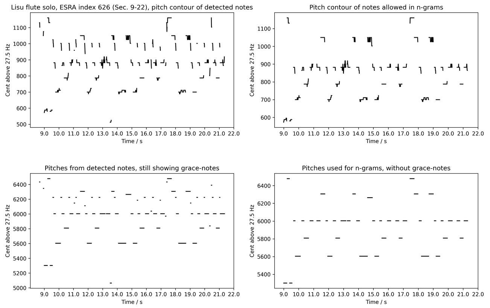

=================
Pitch Track
=================

The pitch track of the COMSAR framework extracts pitch from a soundfile, accumulates pitches into an octave, detects notes, vibrato, slurs, or melisma, determines most likely tonal systems, extracts the melody, and calculates n-gram histograms.

The pitchtrack instance should contain the frame size and hop ratio. In the example below 100 pitches per second are analyzed (see jupyter example notebook **COMSAR_Melody_Example.jpynb**)

``params=aps.SegmentationParams(1102,1102-441,True)``

``tt = PitchTrack(params)``

Then a .wav file can be analyzed with respect to pitch values

``a=tt.extract('soundfiles/esra_005_00626.wav')``

Then parameters are determined to for tonal system and melody extraction

``dcent=1 #Analysis precision in cent``

``noctave=8 #Analysis width in octaves``

``f0=27.5 #Lowest frequency in analysis``

``dst=0.1 #Standard deviation of correlation between tonal system and calculated cent values in cent``

``minlen=3 #Minimum length of adjacent cents to be accepted as a musical event (as a note, etc.)``

``mindev=60 #Maximum deviation accepted for an event to be a continuous note, etc. in cent. Ext: 50 mean +-50cent``

``minnotelength = 10#minimum note length to qualify of a pitch_type instance as a note used in ngram calculation``

``ngram = 5 #n-gram depth``

``ngcentmin = 0``

``ngcentmax = 1200``

``nngram = 10``

In the jupter notebook **COMSAR_Melody_Example.jpynb** the n-grams are in the variable result[10] as coded ngram list. 

E.g.: 3-gram, nngram = 10, ngcentmax = 1200 leads to 10 ngrams x 2 intervals (3-grams) = 20 values in array

[n-gram 1 1st interval, n-gram 1, 2nd interval, n-gram 2 1st interval, n-gram 2, 2nd interval,...], most frequent n-gram first

gram value coding: ngcentmax = 12000 leads to +-12 intervals. n-gram value = 0 -> -12 half tones, ngram value = 12 -> 0 half tones, ngram value = 24 -> +12 half tones

Then the extraction is performed

``tt.extract_TonalSystem(a.data[:,0], dcent, dst, minlen, mindev, noctave, f0, minnotelength, ngram, ngcentmin, ngcentmax, nngram)``

All pieces are analyzed in terms of pitch and melody. Five levels of abstraction are performed, as shown for the example of a Lisu solo flute piece in Fig. below (ESRA index 626, https://vimeo.com/showcase/5259277/video/278497941).

=================
Melody, n-grams
=================

**In a first analysis stage'**, the original sound files are analyzed with respect to pitch, where n pitch values are calculated per second, determined by the args used in the instantiation of the pitchtrack. Pitch analysis is performed using autocorrelation method, where the first peak of the autocorrelation function determines the periodicity of the pitch. 

For frequencies below about 50 Hz the result of the autocorrelation is not precise. In nearly all cases the amount of period cycles the autocorrelation integrates over is not an integer, but a fraction of one period is integrated over at the end of the sound. With higher frequencies this is not considerable. Still with low frequencies, due to the few sound period cycles the autocorrelation integrates over, this leads to uncorrect results. Here an algorithm is used to compensate for overintegration. For frequencies above 1.7 kHz, results again are not correct due to the limited sample frequency, allowing only certain periods. Here, oversampling is performed to compensate for incorrectness. Still, in most cases melody falls into human singing range and therefore the algorithm does not need these corrections. 

The pitches are transferred into cent, using a fundamental frequency of f0 to be determined in the args (f0 = 27.5 Hz is recommended for subcontra A) in noctaves above f0 (noctaves = 8 is recommended), and a cent precision dcent (dcent = 1 cent is recommended).

**The second abstraction stage** uses an agent-based approach, where musical events, notes, grace-notes, slurs, melismas, etc. are detected. The agent follows the cent values from the start of each musical piece and concatenates adjacent cent values according to two constraints, a minimum length (minlen) a pitch event need to have, and a maximum allowed cent deviation (mindev). So e.g. with pitchtrack instantiated using 100 pitch values per second, a minlen = 3 is 30 ms minimum note length, and mindev = 60 his allows for including vibrato and pitch glides within about one semitone, often found in vocal and some instrumental music. Lowering the allowed deviation often leads to exclusion of pitches, which often have quite strong deviations. As an example an excerpt of 23 seconds of a Lisu solo flute piece is shown in the figure below on the top left. Some pitches show quite regular periodicity, some are slures or grace-notes.

**The third abstraction stage** determines single pitches for each detected event by taking the strongest value of a pitch historgram. As can be seen in the top left figure, often pitches are stable, only to end in some slur in the end. Therefore, taking the mean of these pitches would not represent the main pitch. Using the maximum of a histogram, on the other side, detects the pitch most frequency occuring during the event. On the bottom left this is performed, and can be compared to the top left plot. When listening to the piece, this representation seem to contain still too many pitch events. So. e.g. the events around 6000 cent are clearly perceived as notes, still those small events preceding around 6200 cent are heard as grace-notes. Therefore, to obtain a melody without grace-notes, a fourth stage need to be performed.

**In a fourth stage**, pitch events are selected using three constraints to allow for n-gram construction.  n-grams have shown to represent melodies stable and robust in terms of melody identification, like e.g. in query-by-humming tasks. Here, n adjacent notes are clustered in an n-gram. A musical piece therefore has N-n n-grams, where N is the amount of notes in the piece. The n-grams are not constructed from the notes themselves, but from the intervals between the notes. Therefore, a 3-gram has two intervals. Also, the n-grams are sorted in 12-tone just intonation. Therefore, each interval is sorted into its nearest pitch-class. Further implementations might include using tonal systems as pitch classes. Usually 2-grams or 3-grams are used, sometimes up to 5-grams. All n-grams present in a piece are collected in a historgram, where, in the present study, the nngram most frequent n-grams (ten in this case) are collected into a feature vector to be fed into the machine learning algorithm.

So adjacent notes qualifying for n-gram inclusion need to be such to exclude grace-notes, slurs, etc. This is obtained by demanding the notes to have a certain length (minnotelength in amount of analysis frames), in the example below 100 ms is used (minnotelength = 10 as pitchtrack instantiation with 100 pitches per second was performed). Additionally, a lower (ngcentmin) and upper (ngcentmax) limit for adjacent note intervals is applied. The lower limit is 0 cent in the example, to allow for tone repetition. The upper limit is set to +-1200 cent here, so two octaves, most often enough for traditional music. This does not mean that traditional pieces do not have larger intervals, as e.g. expected in jodeling. Still such techniques are not used in the present music corpus, and even when present, they are not expected to be more frequent than smaller intervals. In the top right figure we see the pitch contours for all allowed notes used in n-gram calculation. Indeed, all grace-notes are gone.

**In a last step**, shown in the bottom right plot, the pitches of each event are again taken as the maximum of the historgram of each event. Now following the musical piece aurally, the events represent the melody. These notes are used for the n-gram vector.

   Example of pitch and melody extraction using Lisu flute solo, ESRA index 626. The analysis has five stages of abstraction. 1) pitches are calculated over the whole piece. From pitch values to melodies: 2) top left: Pitch contours of detected notes, 3) top right) pitch contour of notes allowed for m-grams (melodies), 4) bottom left: mean pitches of allowed notes from plot 2) still showing grace-notes, 5) bottom right: mean pitches of notes allowed for n-grams.

